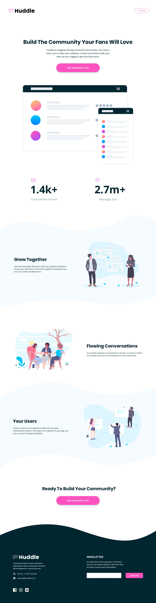

# Frontend Mentor - Huddle landing page with curved sections

This is a solution to the [Huddle landing page with curved sections challenge on Frontend Mentor](https://www.frontendmentor.io/challenges/huddle-landing-page-with-curved-sections-5ca5ecd01e82137ec91a50f2). Frontend Mentor challenges help you improve your coding skills by building realistic projects. 

## Table of contents

- [Overview](#overview)
  - [Screenshot](#screenshot)
  - [Links](#links)
- [My process](#my-process)
  - [Built with](#built-with)
  - [Useful resources](#useful-resources)
- [Author](#author)

## Overview

### Screenshot

 

### Links
- Live Site URL: [ here]()

## My process

### Built with

- Semantic HTML5 markup
- CSS custom properties

### Useful resources

- [ W3Shools](https://www.w3schools.com/csS/css_align.asp) - This helped in properly aligning elements on the page.

## Author

- Behance - [Aniekan](https://www.behance.net/aniekanedet3)
- Frontend Mentor - [@aniekanedet](https://www.frontendmentor.io/profile/aniekanedet)
- Twitter - [@aniekanedett](https://twitter.com/aniekanedett)

